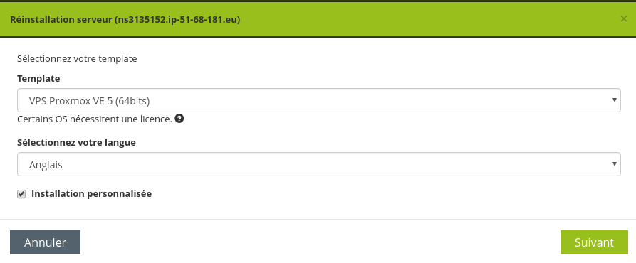
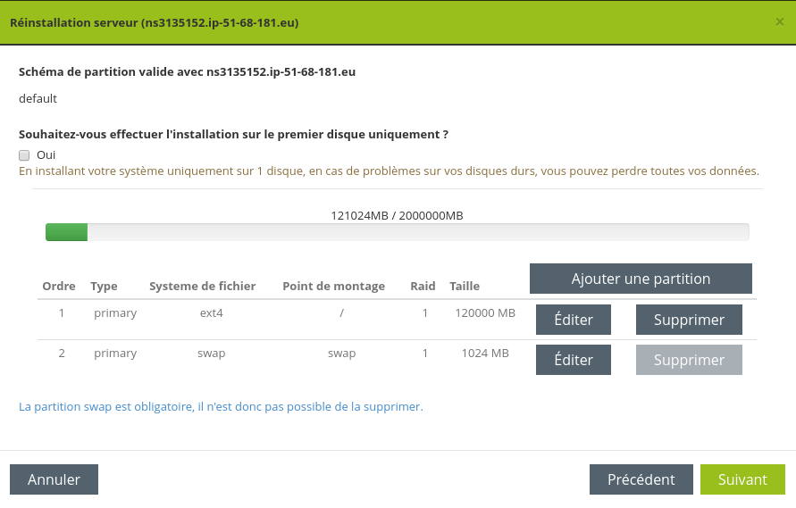
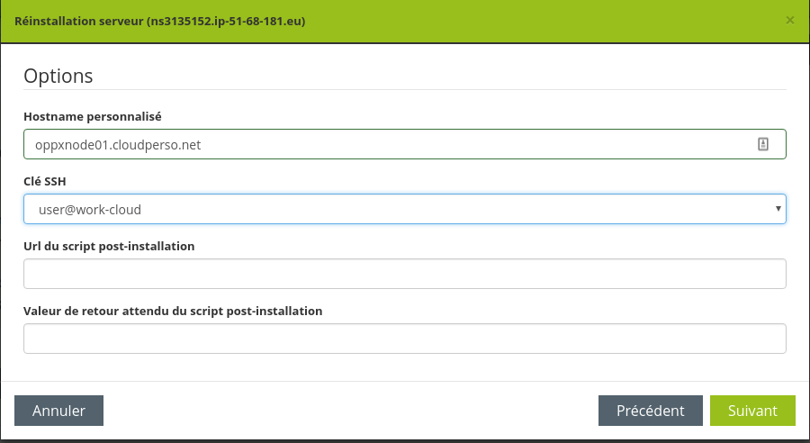

# Follow Soyoustart menu and complete as screenshots below
## Select template


## Partionning


## Options


## Finishing install
Once the 2 proxmox nodes are installed. SSH with root user into it an run the following command:
```bash 
bash -c "$(wget https://raw.githubusercontent.com/cloudperso/proxmox/master/scripts/post-install-soyoustart.sh -qO -)"
```
Then `reboot` your server.
